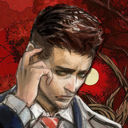

<div align="center">



# SWERY Localization Tool

**Універсальний редактор українізації для ігор Hidetaka Suehiro (SWERY) / White Owls** &nbsp;·&nbsp;
**A unified Ukrainian-localization editor for Hidetaka Suehiro (SWERY) / White Owls games**

[](https://github.com/LittleBitUA/SWERY-Localization-Tool/releases/latest)
[](https://github.com/LittleBitUA/SWERY-Localization-Tool/releases)
[](LICENSE)
[](https://github.com/LittleBitUA/SWERY-Localization-Tool/releases/latest)
[](https://littlebitua.github.io/SWERY-Localization-Tool/)
[](https://www.electronjs.org/)
[](https://react.dev/)

### [⬇️ Завантажити portable / Download portable ⬇️](https://github.com/LittleBitUA/SWERY-Localization-Tool/releases/latest)

### 🌐 [littlebitua.github.io/SWERY-Localization-Tool](https://littlebitua.github.io/SWERY-Localization-Tool/) — landing site / overview

</div>

---

> 🇬🇧 [**English**](#-english) &nbsp;·&nbsp; 🇺🇦 [**Українська**](#-українська)

## 🇬🇧 English

**SWERY Localization Tool** is an open-source desktop editor that bundles the entire translation workflow for **five** Hidetaka Suehiro (SWERY) / White Owls titles: **Deadly Premonition** (Director's Cut), **Deadly Premonition 2: A Blessing in Disguise**, **The Good Life**, **Hotel Barcelona**, and **THE MISSING: J.J. Macfield and the Island of Memories**. One app instead of five — from editing JSON dumps and binary `MSG.*` containers to packing the final patch, with built-in font, texture and per-string box-size editors.

### ✨ Features

**Text workflow**
- 🎮 **Five games in one hub**: Deadly Premonition (via DPMsgTool by [MrIkso](https://github.com/MrIkso)), Deadly Premonition 2 (UABEA format), **The Good Life** (custom binary `loc/English` container), **Hotel Barcelona** (Unity Addressables bundle), and **THE MISSING** (`MSG.*` payload with length-table + IMHeightInfo). Themed FBI-dossier home screen with per-game progress counters.
- 🎯 **THE MISSING — full cycle**: parse/build `msg*en.dat` with stable offset-table, length-table with int16-overflow protection, dedicated `IMHeightInfo` (box-sizes) editor with **Auto-fit** algorithm (ratio × padding, idempotent against repeated apply), on-the-fly lint for placeholder / voice-key rows.
- 💾 **One-click packing**: DP1 — cyrillic glyph substitution + `DPMsgTool.exe from-json`; DP2 — `import-to-assets.ps1` via PowerShell 7 + UABEA. Output goes straight into the game directory.
- 🧠 **Translation Memory (TM)** across both corpora — DP1↔DP2 cross-search with Jaccard fuzzy match. **Bulk TM auto-fill (1:1)** — auto-applies exact source matches (no substring guesswork).
- 📖 **Shared glossary** + **terminology consistency check**: where `src` appears, `tgt` must be present.
- 👤 **Character name consistency** (DP2): detects typo variants (`Йорк / Йорг`), one-click exact-equality rename across all files.
- 🔍 **Global search** across the corpus: regex, case sensitive, field filter (JP / EN / UA / speaker). `Ctrl+Shift+F`.
- ♻️ **Cross-file Find & Replace** (DP2): preview each change → confirm → batch-apply across all files with automatic `.bak`.

**Quality & navigation**
- 🏷️ **Statuses & bookmarks**: `draft / review / approved` + 🔖. Stored in sidecar files — game JSON stays untouched.
- 📐 **Smart subtitle break ("Драбинка")**: balances translation into symmetric lines — no word splits, no orphan prepositions. Per-entry button + cross-file batch.
- 🎨 **Placeholder highlighting** (`{NEXT_SEGMENT}`, `<color=red>`, `\n` etc.) in Monaco + live diagnostics for missing/extra tags.
- 🔤 **DP1 glyph audit**: flags characters outside the 74-glyph substitution map in the editor + corpus-wide audit — catches production bugs before packing.
- 📺 **In-game preview**: renders the active row in DP2 subtitle style — uses the **real game font** (`FOT-NewCinemaAStd-D`) with italic `[i]…[/i]`, placeholder chips and ▽ marker.
- 📊 **Corpus readiness overview**: % completion, UA/EN word & char counts, top-15 files by volume.

**Deadly Premonition**
- 🎮 **Text**: parses `mes_all.json` from DPMsgTool (~20,000 records), CRLF+2-space round-trip, FSL recalculated automatically.
- 🔤 **DP1 Fonts editor (FONTWIDE.DDS)**: pure-JS BC1 decoder/encoder, canvas preview, drag-selection, snap-to-grid, click-to-pick a cell, move with cut+paste, draw-letter modal with Cinema Calligraphy 31.5pt + X/Y offset sliders. `Ctrl+Z` undo. Auto-downloads the official OTF from Dropbox on first run. GlyphMap proposal banner offsets char code by −2 automatically (extended ASCII only) to match the game's render offset.
- 🗜️ **DP1 Textures editor (XPC2)**: custom format reversed — `"XPC2"` magic + zlib-stream DDS/PNG. Recursive scan, extract-all / pack-all with streamed progress, `.bak` on first pack, path-traversal guard.

**Hotel Barcelona**
- 🏨 **Full cycle**: extract → edit → repack for the Unity Addressables bundle (`_resources_assets_all_<hash>.bundle`). Auto-resolves hash when patching the game (hash changes with each update).
- 🛠️ **Patch migration**: when White Owls ship a new patch, the toolkit ports translations from the old hash to the new one automatically + an editor banner warns before saving if the bundle changed.
- 🛡️ **Integrity check**: verifies that `_Text` count in raw matches `items.length` before write — protects against silent byte-shift corruption when bundle structure changes between extract and save.
- ✓ **Right-click → translated**: for template references like `[Continue]` that render as ready text — completion % stays accurate.
- 🖼️ **Textures editor**: extract 24 UI / poster / result textures from the same bundle (Texture2D by PathID inside the `CAB-…` assets-file) to PNG, replace + in-place bundle patch with `.textures.bak` on first save. Inline-mode write (image data ← new bytes, `m_StreamData` cleared) — single uncompressed Write, the same pattern as text / fonts import.

**THE MISSING**
- 📐 **Per-string box-sizes editor**: GUI for editing the `IMHeightInfo` MonoBehaviour (W × H × 4 language slots × thousands of rows). Side-by-side preview + Auto-fit with a multiplier slider (×1.00 — ×1.50), min-padding in pixels, idempotent reference-based ratio (no runaway growth on repeated apply).
- 🔐 **int16-overflow guard**: row length in the `MSG.*` length-table is a signed int16 (max 32767 bytes). The toolkit catches overflows at build time and surfaces a toast with a "Jump →" action that lands the editor on the offending row — instead of the silent `len & 0xFFFF` corruption found in older tools.
- 🎨 **MsgEnum-based stable IDs**: a global enum `msgBase × 10000 + i` — IDs in combined.txt and logs no longer shift when strings grow or shrink.

**Cross-editor essentials**
- 🧊 **Glassmorphic update banner**: macOS-like style — `backdrop-blur` with a highlighted-edge frame. Download speed + percent shown live.
- 🟢 **SaveStatusBadge in Header**: a colour dot reflects file state (⚪ saved, 🟡 dirty, 🟢 autosaved, 🔴 error) with a tooltip + filename.
- 📏 **Monaco font-size**: `[-] [size] [+]` in editor footer, synced across DP2 / HBR / MISSING / DP1.
- 🔀 **Diff EN↔UA modal**: Monaco DiffEditor full-screen side-by-side — instantly catch extra dots, missing tags, whitespace drift.
- 📊 **EditorFooter**: status bar with `Shown / Total / Translated % / Position / Unsaved` counters across DP1/HBR/MISSING.
- 🦺 **Race-free saves**: per-path write queue in Electron main — `saveFile` + `autosave` never race on `.bak` creation.
- 🚪 **Path-traversal guard + settings allow-list**: the renderer cannot write into system directories; `dp2:save-settings` accepts only whitelisted keys.

**Font workshop (DP2)**
- 🔠 **Font workshop**: dedicated "Fonts" tab on the DP2 card — export 7 asset fonts (`FOT-NewRodinProN-DB`, `FOT-NewCezannePro-DB`, `FOT-NewCezannePro-M`, `FOT-NewCinemaAStd-D`, `FOT-Wentworth`, `FOT-UDKakugo_LargePro-R`, `FOT-MatisseProN-UB`) from `resources.assets` and `sharedassets0.assets` as TTF/OTF, replace with your own + repack into the matching `.assets` file with `.bak`.
- 🔬 **Live preview**: as soon as exported, fonts are registered via FontFace API. After Replace — instant cache-bust so the new font shows up without a re-export from the game.

**Texture workshop (DP2)**
- 🖼️ **Texture workshop**: export PNG character portraits from `resources.assets` (DXT5/BC3 → PNG), replace + in-place patch the `.assets` + `.resS` pair (offset table preserved). 22 textures shipped in the list (Francis, Simon, Clarkson family, Woods, Davis etc.).
- 📦 **Export all in one click**: dumps all previews into `Documents\DP2-Localization-Tools\dp2-textures\`.

**The Good Life fonts**
- 🔡 **Bitmap-font editor**: unpacks the `c0718fc478f6943d` bundle (Unity Asset Bundle with Font + Texture2D), edits `m_CharacterRects.Array`, add/remove glyphs directly on the atlas.
- ✏️ **AddGlyph modal**: pick a TTF that has the missing letters (Є є І і Ї ї Ґ ґ), enter a target list "Є, є, і, …" — the app locates a free atlas region, Y-flips the bitmap correctly, fills in `uv` / `vert` / `advance` and re-packs into the CAB bundle.
- 🎯 **In-game preview** uses the real atlas and `vert.x/y` metrics — you see exactly what the engine renders.
- 🗑️ **Delete key** on a selected glyph: removes the record and clears the bitmap region with a transparent rectangle so leftover pixels don't bleed.
- 🌐 **External locale files**: `userData/locales/{uk,en}.json` are merged on top of the built-in dictionary, so translators can edit strings without rebuilding the app.

**Workflow & safety**
- 💼 **Auto-save + crash recovery**: unsaved edits flush to `.autosave.json` every 30s; on reload, the app offers to restore.
- 📤 **`.txt` round-trip** for external translators (ID-based mapping, preserve-translated).
- 🔧 **Bulk operations**: copy-original, trim, mark-approved — across selection.
- 🍞 **Toast notifications** in the bottom-right corner — status messages never break header layout.
- 🌐 **UK / EN UI** with instant switching.
- ⚙️ **First-run wizard**: auto-downloads UABEA Next and PowerShell 7.
- 🚀 **Worker threads + JSON cache** (LRU 300 files, mtime validation) — repeated cross-file ops are instant.

### 📦 Quick start

1. Download the portable `.exe` from [Releases](https://github.com/LittleBitUA/SWERY-Localization-Tool/releases/latest).
2. Launch — the first-run wizard will set paths and download dependencies.
3. On the home screen pick a game:
   - **Deadly Premonition** → point to DPMsgTool's `eng.json`.
   - **Deadly Premonition 2** → open the folder with `sharedassets0.assets` JSON dumps.
4. Translate. Press **Build .mes** (DP1) or **Save & build** (DP2) — the file lands in the game directory.

### 🛠️ Shortcuts

| Action | Shortcut |
| --- | --- |
| Save + jump to next untranslated | `Ctrl+Enter` |
| Next untranslated | `Ctrl+J` |
| Move between rows | `Alt+↑/↓` |
| Copy original | `Ctrl+D` |
| Save | `Ctrl+S` |
| Find & Replace in file | `Ctrl+H` |
| Global search | `Ctrl+Shift+F` |
| Glossary | `Ctrl+G` |
| TM panel (toggle) | `Ctrl+Shift+T` |
| Focus mode | `Ctrl+\` |
| Bookmark | `Ctrl+B` |
| Status draft / review / approved | `Alt+1` / `Alt+2` / `Alt+3` |

### 🧩 Build from source

```bash
git clone https://github.com/LittleBitUA/SWERY-Localization-Tool.git
cd SWERY-Localization-Tool
npm install
npm run dev          # Vite + Electron in dev mode
npm run build:exe    # Portable .exe → release/
```

Requires Node.js 18+ and Windows for the portable `.exe` artifact.


---

## 🇺🇦 Українська

**SWERY Localization Tool** — настільний редактор з відкритим кодом для українізації **п'яти** ігор Hidetaka Suehiro (SWERY) / White Owls: **Deadly Premonition** (Director's Cut), **Deadly Premonition 2: A Blessing in Disguise**, **The Good Life**, **Hotel Barcelona** і **THE MISSING: J.J. Macfield and the Island of Memories**. Один інструмент замість п'яти — від редагування JSON-дампів і бінарних `MSG.*` контейнерів до запаковки готового патчу, з вбудованим редактором шрифтів, текстур і per-string box-sizes.

### ✨ Можливості

**Робота з текстом**
- 🎮 **П'ять ігор в одному хабі**: Deadly Premonition (DPMsgTool by MrIkso), Deadly Premonition 2 (UABEA-формат), **The Good Life** (власний бінарний `loc/English`), **Hotel Barcelona** (Unity Addressables bundle) і **THE MISSING** (`MSG.*` payload з length-table). Тематичний головний екран у стилі FBI-дозьє з лічильниками прогресу для кожної гри.
- 🎯 **THE MISSING — повний цикл**: парсинг/збірка `msg*en.dat` із збереженням offset-table, length-table з захистом від int16-overflow, окремий редактор `IMHeightInfo` (box-sizes) із **Auto-fit** алгоритмом (ratio × padding, idempotent проти повторних apply), на льоту lint placeholder/voice-key рядків.
- 💾 **Запаковка одним кліком**: для DP1 — підстановка кириличних гліфів і `DPMsgTool.exe from-json`; для DP2 — `import-to-assets.ps1` через PowerShell 7 + UABEA. Готовий файл одразу у директорії гри.
- 🧠 **Пам'ять перекладів (TM)** з обох корпусів — cross-search DP1↔DP2, Jaccard fuzzy. **Bulk TM auto-fill (1:1)** — авто-заповнення неперекладених рядків з exact-match source (без substring-замін).
- 📖 **Спільний глосарій** + **перевірка термінологічної консистентності** — всюди де `src` зустрічається, `tgt` має бути присутній.
- 👤 **Перевірка консистентності імен героїв** (DP2): шукає типос-варіанти (`Йорк / Йорг`), one-click exact-equality перейменування по всіх файлах.
- 🔍 **Глобальний пошук** по корпусу: regex, case-sensitive, фільтр по полю. `Ctrl+Shift+F`.
- ♻️ **Cross-file Find & Replace** (DP2): pre-flight з прев'ю кожної заміни → confirm → execute по всіх файлах із автоматичним `.bak`.

**Якість і навігація**
- 🏷️ **Статуси і закладки**: `draft / review / approved` + 🔖. Sidecar-файли, JSON гри не чіпається.
- 📐 **Smart subtitle break ("Драбинка")**: балансує переклад у симетричні рядки без розривів слів і сирітських прийменників — per-entry та **cross-file batch** для всього корпусу.
- 🎨 **Підсвічування плейсхолдерів** (`{NEXT_SEGMENT}`, `<color=red>`, `\n`) у Monaco + live-діагностика втрачених/зайвих тегів.
- 🔤 **DP1 glyph audit**: позначає символи поза мапою підміни (74 гліфи) у редакторі + загальний аудит — production-баги до запаковки.
- 📺 **In-game preview**: рендерить активний рядок у стилі реальних субтитрів DP2 — використовується **справжній шрифт гри** (`FOT-NewCinemaAStd-D`), з курсивом `[i]…[/i]`, плейсхолдер-чіпами і ▽-маркером.
- 📊 **Огляд готовності корпусу**: підсумок % завершеності, UA/EN слова й символи, топ-15 файлів за обсягом.

**Deadly Premonition**
- 🎮 **Текст**: парсинг `mes_all.json` від DPMsgTool (20 000+ записів), CRLF+2-space round-trip, FSL перерахунок.
- 🔤 **DP1 Fonts editor (FONTWIDE.DDS)**: pure-JS BC1 decoder/encoder, canvas-preview, drag-selection прямокутника, snap-to-grid, click-to-pick клітинки, move (cut+paste), draw-letter модалка з Cinema Calligraphy 31.5pt + X/Y offset слайдерами. `Ctrl+Z` undo. Auto-download офіційного OTF з Dropbox при першому open. GlyphMap proposal banner з −2 char-code offset для extended ASCII.
- 🗜️ **DP1 Textures editor (XPC2)**: custom-формат розкритий — magic `"XPC2"` + zlib-stream DDS/PNG. Recursive scan, extract all / pack all з streamed progress, `.bak` на перший pack, path-traversal guard.

**Hotel Barcelona**
- 🏨 **Повний цикл**: extract → edit → repack для Unity Addressables-бандла (`_resources_assets_all_<hash>.bundle`). Auto-resolve хешу при patching гри (хеш міняється з кожним апдейтом).
- 🛠️ **Patch migration**: коли White Owls випустили новий патч, програма автоматично переносить переклади зі старого хешу на новий + банер у редакторі попереджує перед збереженням якщо bundle оновлено.
- 🛡️ **Integrity check**: перевірка що кількість `_Text` у raw збігається з items.length перед записом — захист від silent byte-shift корупції коли структура змінилася між extract і save.
- ✓ **Right-click → перекладено**: для template references типу `[Continue]` що рендеряться як готовий текст — % завершення рахується точніше.
- 🖼️ **Редактор текстур**: extract 24 UI / poster / result текстур з того ж бандла (Texture2D за PathID всередині `CAB-…` assets-файлу) у PNG, заміна + in-place патч bundle з `.textures.bak` на першому збереженні. Inline-mode запис (image data ← нові байти, `m_StreamData` очищено) — single uncompressed Write, той самий патерн що text / fonts import.

**THE MISSING**
- 📐 **Per-string box-sizes editor**: GUI для редагування `IMHeightInfo` MonoBehaviour (W × H × 4 language slots × тисячі рядків). Side-by-side preview + Auto-fit з multiplier-слайдером (×1.00 — ×1.50), мін. запас у пікселях, idempotent reference-based ratio (не наростає при повторному apply).
- 🔐 **int16-overflow guard**: довжина рядка у `MSG.*` length-table — signed int16 (max 32767 байтів). Програма ловить overflow при build і кидає toast з кнопкою "Перейти →" що стрибає на проблемний рядок — замість silent `len & 0xFFFF` корупції.
- 🎨 **MsgEnum-based стабільні ID**: глобальний enum `msgBase × 10000 + i` — у combined.txt і у logs ID не зсувається при росту/скороченні рядків.

**Спільне для всіх редакторів**
- 🧊 **Glassmorphic update banner**: новий стиль (macOS-like) — `backdrop-blur` + матове скло з рамкою-highlight. Прогрес-бар скачування + швидкість.
- 🟢 **SaveStatusBadge у Header**: кольорова крапка показує стан файла (⚪ збережено, 🟡 dirty, 🟢 autosaved, 🔴 помилка) з tooltip-ом + ім'я файла.
- 📏 **Monaco font-size**: `[-] [size] [+]` у footer редактора, синхронізовано між DP2/HBR/MISSING/DP1.
- 🔀 **Diff EN↔UA modal**: Monaco DiffEditor у side-by-side fullscreen — миттєво видно зайві крапки, втрачені теги, різницю whitespace.
- 📊 **EditorFooter**: статус-бар з лічильниками `Видно / Усього / Перекладено % / Позиція / Незбережено` для DP1/HBR/MISSING.
- 🦺 **Race-free saves**: per-path write-queue у Electron main — `saveFile` + `autosave` не race-аться на створенні `.bak`.
- 🚪 **Path-traversal guard + settings allow-list**: renderer не може писати у системні директорії; `dp2:save-settings` приймає тільки whitelisted-ключі.

**Робота зі шрифтами (DP2)**
- 🔠 **Font workshop**: окрема вкладка "Шрифти" на DP2-картці — експорт 7 ассетних шрифтів (`FOT-NewRodinProN-DB`, `FOT-NewCezannePro-DB`, `FOT-NewCezannePro-M`, `FOT-NewCinemaAStd-D`, `FOT-Wentworth`, `FOT-UDKakugo_LargePro-R`, `FOT-MatisseProN-UB`) з `resources.assets` і `sharedassets0.assets` як TTF/OTF, заміна на свій + repack у відповідний `.assets` файл із `.bak`.
- 🔬 **Live preview**: щойно експортовано — шрифт реєструється через FontFace API. Після заміни — миттєвий cache-bust і preview оновлюється без re-export з гри.

**Робота з текстурами (DP2)**
- 🖼️ **Texture workshop**: експорт PNG обличчя персонажів з `resources.assets` (DXT5/BC3 → PNG), заміна на свій + in-place patching `.assets` + `.resS` (зі збереженням offset table). 22 текстури в готовому списку (Френсіс, Сімон, родини Кларксонів, Вудс, Девіс і т.д.).
- 📦 **Export all одним кліком**: масово витягуємо всі прев'ю у `Documents\DP2-Localization-Tools\dp2-textures\`.

**Шрифти The Good Life**
- 🔡 **Bitmap-font editor**: розпаковка bundle-файлу `c0718fc478f6943d` (Unity Asset Bundle із Font + Texture2D), правка `m_CharacterRects.Array`, додавання/видалення гліфів просто на атласі.
- ✏️ **AddGlyph модалка**: вибираєш TTF з відсутніми літерами (Є є І і Ї ї Ґ ґ), задаєш ціль "Є, є, і, ..." — програма знаходить вільне місце на атласі, малює гліф з правильним Y-flip-ом, оновлює `uv`/`vert`/`advance` і запаковує назад у CAB-bundle.
- 🎯 **In-game preview** з реального атласу та `vert.x/y`-метрик — бачиш точно те, що покаже рушій.
- 🗑️ **Delete-клавіша** на вибраному гліфі: видаляє запис + затирає bitmap-ділянку прозорим прямокутником, щоб не "залипало" на атласі.
- 🌐 **Зовнішні файли локалізації**: `userData/locales/{uk,en}.json` мерджаться поверх вбудованих — інші перекладачі можуть правити рядки без перебудови програми.

**Workflow і безпека**
- 💼 **Auto-save + crash recovery**: незбережені правки скидаються у `.autosave.json` через 30с; при наступному відкритті — пропонує відновити.
- 📤 **`.txt` round-trip** для зовнішніх перекладачів (ID-based mapping, preserve-translated).
- 🔧 **Bulk-операції**: copy-original, trim, mark-approved — масово.
- 🍞 **Toast-сповіщення** у правому нижньому куті — статус-меседжі не ламають layout.
- 🌐 **Інтерфейс UK / EN** з миттєвим перемиканням.
- ⚙️ **Майстер першого запуску**: автозавантажує UABEA Next і PowerShell 7.
- 🚀 **Worker-threads + JSON cache** (LRU 300 файлів, mtime-валідація) — повторні cross-file операції миттєві.

### 📦 Швидкий старт

1. Завантаж portable `.exe` з [Releases](https://github.com/LittleBitUA/SWERY-Localization-Tool/releases/latest).
2. Запусти — пройди майстер налаштування (вкаже шлях до гри і автоматично завантажить інструменти).
3. На головному екрані обери гру:
   - **Deadly Premonition** → вкажи `eng.json` від DPMsgTool.
   - **Deadly Premonition 2** → відкрий теку з JSON-дампами `sharedassets0.assets`.
4. Перекладай. Натисни **Запакувати .mes** (DP1) або **Зберегти та зібрати** (DP2) — готовий файл одразу опиняється у грі.

### 🛠️ Шорткати

| Дія | Шорткат |
| --- | --- |
| Зберегти + наступний неперекладений | `Ctrl+Enter` |
| Наступний неперекладений | `Ctrl+J` |
| Між рядками таблиці | `Alt+↑/↓` |
| Копіювати оригінал | `Ctrl+D` |
| Зберегти | `Ctrl+S` |
| Find & Replace у файлі | `Ctrl+H` |
| Глобальний пошук | `Ctrl+Shift+F` |
| Глосарій | `Ctrl+G` |
| TM-панель (toggle) | `Ctrl+Shift+T` |
| Focus mode | `Ctrl+\` |
| Закладка | `Ctrl+B` |
| Статус draft / review / approved | `Alt+1` / `Alt+2` / `Alt+3` |

### 🧩 Збірка з джерел

```bash
git clone https://github.com/LittleBitUA/SWERY-Localization-Tool.git
cd SWERY-Localization-Tool
npm install
npm run dev          # Vite + Electron у dev-режимі
npm run build:exe    # Portable .exe → release/
```

Потрібно: Node.js 18+ та Windows для збірки портативного `.exe`.


## 📚 Modding notes

- [`docs/TGL-modding-notes.txt`](docs/TGL-modding-notes.txt) — reverse-engineering write-up for The Good Life: text container layout (`loc/English`), font bundle structure (`c0718fc478f6943d`), the `flipped` + negative-`uv.height` convention that catches every home-grown tool, atlas write-back pipeline, 64-bit PathID precision pitfalls, and Unity 2020.1.17f1 specifics.
- [`docs/THE-MISSING-modding-notes.txt`](docs/THE-MISSING-modding-notes.txt) — full write-up for THE MISSING: the `MSG.*` payload layout, length-table semantics, the int16 overflow trap that breaks Cyrillic translations, `IMHeightInfo` MonoBehaviour box-sizes structure, the 4-language slot convention, Auto-fit algorithm with idempotency notes, write-back pipeline through UABEANext, six common pitfalls (PathID drift, CR/LF, NULL-pad, section 2, UABEA Edit Asset vs Edit Data, antivirus locks), and why we did NOT reuse TranslationFramework2 source code.

Both write-ups are useful even if you don't use this app — they're written for anyone building their own modding tools.

## 🧱 Tech Stack

- [Electron](https://www.electronjs.org/) 33 (portable build via `electron-builder`)
- [React](https://react.dev/) 18 + [Zustand](https://zustand-demo.pmnd.rs/) for state
- [Monaco Editor](https://microsoft.github.io/monaco-editor/) (VS Code's engine) as the translation editor
- [Tailwind CSS](https://tailwindcss.com/) — GitHub-inspired dark theme
- [Vite](https://vitejs.dev/) for blazing-fast dev cycles
- Node `worker_threads` for heavy JSON parsing / searches

## 🙏 Credits

- [MrIkso](https://github.com/MrIkso) — `.mes`↔JSON CLI (DPMsgTool) for DP1 packing.
- [nesrak1/UABEA](https://github.com/nesrak1/UABEA) — Unity asset editor whose libraries (`AssetsTools.NET.dll`, `classdata.tpk`) drive DP2 packing.
- [PowerShell/PowerShell](https://github.com/PowerShell/PowerShell) — PS7 portable bundled at first run.

## 📜 License

[MIT](LICENSE) — free for personal and team use. Game content (`.assets`, `.mes`) belongs to the respective publishers and is **not** redistributed by this tool.

---

<div align="center">

Made with ☕ and 🇺🇦 by **Little Bit UA**

</div>
